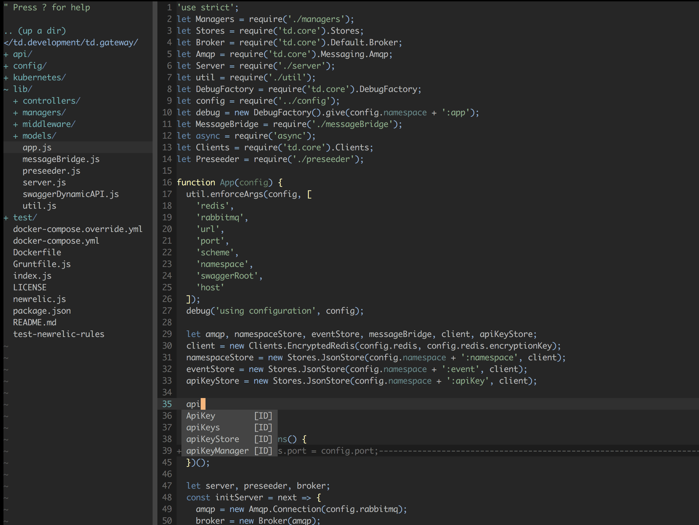
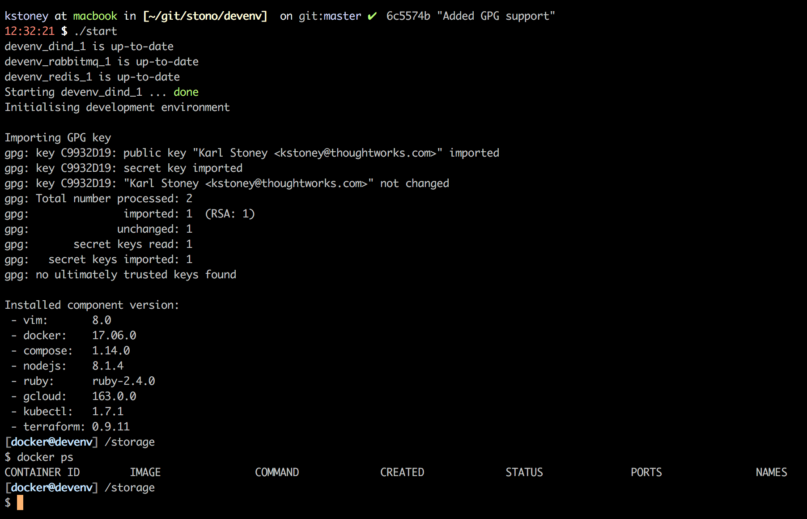

# Devenv
This is my entire development environment, inside a set of containers.

The purpose here is that I can easily lift and shift my entire environment between machines, and ensure consistency across every environment.

There is also the fact that I don't trust a lot of modules that we install in NPM, Ruby etc, so I want to do all my development in an environment which is as isolated as possible from my host machine.

## Components
The following components are installed:

  - vim:       8.0
  - docker:    17.06.0
  - compose:   1.14.0
  - nodejs:    8.1.4
  - ruby:      ruby-2.4.0
  - gcloud:    163.0.0
  - kubectl:   1.7.1
  - terraform: 0.9.11
  - ansible:   2.3.1.0

### VIM (as an IDE)
Vim is a compiled latest version (8) from the vim repo.  It is then configured with a whole bunch of extensions (see the Dockerfile) to basically turn it into a terminal IDE.

### Node/Ruby
I'm using nvm and rvm for both.  The versions I've installed by default are listed above.

### Docker in Docker
As 95% of what i do involves docker, I needed docker available in my development environment.  I didn't want to be mounting the docker socket from my host, I wanted something totally isolated.  As a result I use docker-in-docker which gives you an isolated instance of docker inside the development environment.

## Persistence
There are several volumes being used:

### Named volumes
These are volumes which live inside docker, not exposed to your host OS but are used to persist data between environments.

#### code:/storage
This is a docker volume, and your working directory inside the environment.  The reason we don't mount a host volume here is because we don't want invalid file permissions, or things in `node_modules` that are compiled against your host OS rather than the devenv.  As a result, you should be cloning and working inside the devenv.

The reason I use a docker named volume rather than a bind mount to your host is because the performance of bind mounts is significantly worse than using native storage for MacOSX hosts.  This is because the mount has to bridge the QEMU2 virtual machine.   This is even worse for situations where there are lots of files, for example a `node_modules` directory.  This issue is compounded even further because the file permissions are different on your host than they are inside docker, so things *can* just get messy.

**If you're not a VIM user** and want to edit files on your host, simply edit lines 16 and 27 in `docker-compose.yml` to be `./code` instead of `code`, and it'll mount the local folder `./code` instead.

#### docker:/var/lib/docker
This is a volume used for persistence of the docker-in-docker stuff.  IE.  Any `docker build/pull` you do inside the devenv persists here.

#### home:/home/docker
This creates persistence for the home directory of the container in between runs.  For example; you'll get a persistent bash history and `.config` folder etc.

### Host mounted volumes

#### ./host:/host
This is a bind mount from your host into the environment, in case you do need to copy anything easily between devenv and your host.  The only real use I have for this at the moment is to import my GPG key.

## GPG
If you use git-crypt/gpg etc, put a `gpg.key` in `./host` and it will be auto imported into the gpg2 keyring inside the container.

## Use
Simply type `./start.sh`, I alias it in my `~/.zshrc` like this `alias devenv='cd ~/git/stono/devenv && ./start'`, so I can simply type `devenv` from the terminal to enter the environment.

